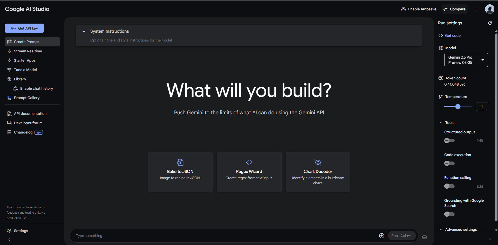

# Google GenAI Intensive Course 2025 Q1

This is a repo that hold the course content of the GenAi course, which has been slightly modified to work locally on my local system.
Requirements:

- Python (I use 3.12)
- MSVC C++ (Required to install the chromadb package used in Day 2 - Document Q&A with RAG)
- Packages that have been listed in the requirements.txt file in the repo

To start, run `pip install -r requirements.txt` once you have cloned and navigated to the directory.

Then set the google API key have generated in a .env file. (If you haven't generated one, go here: https://aistudio.google.com/. You should see a big blue button below the Google AI Studio logo).

I have tried to limit my tinkering with the notebooks to keep them as close to the original as possible, which was created by Mark MCD and others: https://www.kaggle.com/markishere
